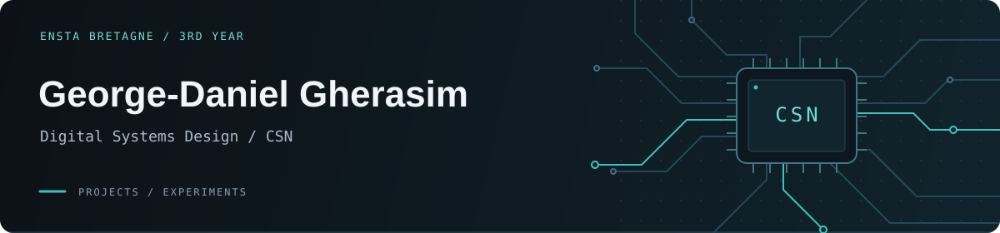

  

  
  
  

Third-year engineering student at ENSTA Bretagne, specializing in
Digital Systems Design (CSN — Conception de systèmes numériques).

This profile brings together my projects and experiments.

## Working with AI

I use AI coding assistants in my projects, including to write code
in languages I don't yet master. The technologies present in my
repositories don't necessarily reflect what I can use independently.

## Projects

- [ChaosAI](https://github.com/ElMonstroDelBrest/ChaosAI) —
  Experiments with machine learning for time series.

## Contact

[george-daniel.gherasim@ensta.fr](mailto:george-daniel.gherasim@ensta.fr)

## Contributions

<picture>
  <source media="(prefers-color-scheme: dark)" srcset="https://raw.githubusercontent.com/ElMonstroDelBrest/ElMonstroDelBrest/output/github-snake-dark.svg" />
  <source media="(prefers-color-scheme: light)" srcset="https://raw.githubusercontent.com/ElMonstroDelBrest/ElMonstroDelBrest/output/github-snake.svg" />
  
</picture>
