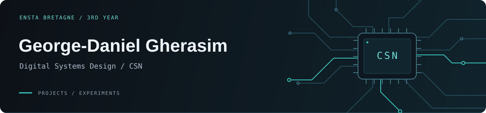

  

  
  
  

Third-year engineering student at ENSTA Bretagne, specializing in
Digital Systems Design (CSN — Conception de systèmes numériques).

My projects sit between hardware and machine learning: models running
on-device, side-channel analysis of cryptographic hardware, and
self-supervised learning on time series.

## Projects

### Machine learning

| Project | Description | Stack |
| --- | --- | --- |
| [**ChaosAI**](https://github.com/ElMonstroDelBrest/ChaosAI) | Self-supervised foundation model for chaotic time series (Mamba JEPA + flow matching). Shows that the standard out-of-sample protocol leaks, and how a flow-matching objective removes the gap. | JAX · Python |
| [**SkinFusionNet**](https://github.com/ElMonstroDelBrest/SkinFusionNet) | Multimodal skin-lesion classifier combining CNN embeddings with ABCD descriptors, running on-device in an Android app. Research prototype with “Dunărea de Jos” University of Galați. | PyTorch · ONNX · Flutter |
| [**Quantnuis**](https://github.com/ElMonstroDelBrest/Quantnuis-Web-Site) | Noisy-vehicle detection from audio with a cascaded pipeline (vehicle detection → noise level), served through a web platform. ENSTA Bretagne project. | TensorFlow · FastAPI · Angular · AWS |

### Hardware and systems

| Project | Description | Stack |
| --- | --- | --- |
| [**npuwhisper**](https://github.com/ElMonstroDelBrest/npuwhisper) | Local Whisper dictation for GNOME Wayland, running entirely on the Intel Core Ultra NPU. Shortcut, top-bar icon, text pasted into the focused app. | OpenVINO · Python · GNOME |
| [**Secu_Comp**](https://github.com/ElMonstroDelBrest/Secu_Comp) | Electromagnetic side-channel attack (CPA) on an AES-128 FPGA implementation: all 16 key bytes recovered from 20,000 traces. | MATLAB |

## Working with AI

I use AI coding assistants in my projects, including to write code in
languages I don't yet master. The technologies in my repositories don't
necessarily reflect what I can use independently.

Models and harness

 

I use the following OpenAI models through **Codex**:

| Model | Focus |
| --- | --- |
| [GPT-6 Astra](https://developers.openai.com/api/docs/models/gpt-6-astra) | Complex reasoning and demanding development tasks. |
| [GPT-6 Sol](https://developers.openai.com/api/docs/models/gpt-6-sol) | Coding and tasks involving multiple steps and tools. |
| [GPT-6 Luna](https://developers.openai.com/api/docs/models/gpt-6-luna) | Focused tasks, with an emphasis on speed and efficiency. |

The models provide reasoning and code generation.
[Codex](https://developers.openai.com/blog/codex-as-a-platform) is the
**agent harness**: the software that manages the task context and connects
the selected model to tools for reading and editing files, running terminal
commands, and working with Git.

## Contact

[george-daniel.gherasim@ensta.fr](mailto:george-daniel.gherasim@ensta.fr)

## Contributions

<picture>
  <source media="(prefers-color-scheme: dark)" srcset="https://raw.githubusercontent.com/ElMonstroDelBrest/ElMonstroDelBrest/output/github-snake-dark.svg" />
  <source media="(prefers-color-scheme: light)" srcset="https://raw.githubusercontent.com/ElMonstroDelBrest/ElMonstroDelBrest/output/github-snake.svg" />
  
</picture>
